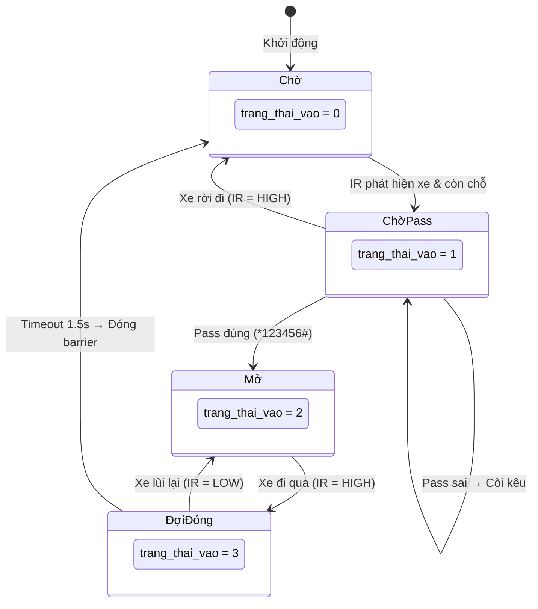

<p align="center">
  
  
  
  
</p>

<h1 align="center">🅿️ HỆ THỐNG QUẢN LÝ BÃI GIỮ XE THÔNG MINH</h1>
<h3 align="center"><em>Smart Parking Management System</em></h3>

<p align="center">
  Dự án tiểu luận môn <strong>Vi Điều Khiển</strong> — Ứng dụng STM32F103C8T6 (ARM Cortex-M3)<br/>
  để xây dựng hệ thống quản lý bãi xe tự động với điều khiển Bluetooth, báo cháy khẩn cấp và chiếu sáng thông minh.
</p>

<p align="center">
  <a href="#-tổng-quan">Tổng quan</a> •
  <a href="#-tính-năng">Tính năng</a> •
  <a href="#%EF%B8%8F-phần-cứng">Phần cứng</a> •
  <a href="#-sơ-đồ-chân-gpio">Sơ đồ chân</a> •
  <a href="#-cài-đặt--nạp-code">Cài đặt</a> •
  <a href="#-cách-sử-dụng">Sử dụng</a> •
  <a href="#-nhóm-thực-hiện">Nhóm</a>
</p>

---

## 📋 Tổng quan

| Thông tin | Chi tiết |
|:--|:--|
| **Trường** | Đại học Khoa học Tự nhiên — ĐHQG TP.HCM |
| **Khoa** | Điện tử — Viễn thông |
| **Môn học** | Vi Điều Khiển |
| **Lớp** | 24DTV_DKD3 — Nhóm 10 |
| **Năm** | 2026 |

Trong bối cảnh đô thị hóa nhanh chóng, việc quản lý bãi xe thủ công đã bộc lộ nhiều hạn chế: ùn tắc giờ cao điểm, rủi ro an ninh và lãng phí nhân lực. Dự án này xây dựng một **mô hình bãi giữ xe thông minh** trên nền tảng vi điều khiển **STM32F103C8T6**, tích hợp xác thực qua Bluetooth, điều khiển barrier bằng Servo, cảm biến hồng ngoại phát hiện xe và hệ thống báo cháy khẩn cấp — tất cả hoạt động trong thời gian thực.

---

## ✨ Tính năng

### 🚗 Quản lý xe vào/ra
- **Cổng vào** — Phát hiện xe bằng cảm biến IR → Yêu cầu nhập mật khẩu qua App Bluetooth → Mở barrier tự động → Đóng an toàn sau 1.5 giây
- **Cổng ra** — Phát hiện xe bằng cảm biến IR → Mở barrier tự động (không cần mật khẩu) → Đóng an toàn sau 1.5 giây
- **Đếm chỗ trống** — Tự động tăng/giảm và hiển thị trên LCD 16×2 theo thời gian thực

### 🔐 Phân quyền bảo mật
| Vai trò | Mã lệnh | Chức năng |
|:--|:--|:--|
| **User** | `*123456#` | Mở cổng vào (khi có xe đứng trước cảm biến) |
| **Admin** | `*888888#` | Mở đồng thời cả 2 cổng |
| **Admin** | `*888888IN#` | Mở riêng cổng vào |
| **Admin** | `*888888OUT#` | Mở riêng cổng ra |
| **Admin** | `*888888CLOSE#` | Đóng khẩn cấp cả 2 cổng |
| **Admin** | `*888888DEN#` | Chuyển chế độ đèn sân bãi (Auto → Bật → Tắt) |

### 🔥 An toàn khẩn cấp
- **Báo cháy tự động** — Cảm biến lửa (Flame Sensor) kích hoạt → Mở toàn bộ barrier → Còi + LED đỏ nháy 2Hz
- **Nút nhấn vật lý (PB9)** — Mở cổng thủ công + Tắt báo cháy để khôi phục hệ thống

### 💡 Chiếu sáng thông minh
- **Auto** — Bật/tắt đèn sân bãi dựa trên cảm biến quang trở (LDR)
- **Manual ON / OFF** — Admin can thiệp thủ công qua Bluetooth

### 📡 Kết nối Bluetooth thông minh
- Giao tiếp qua module **JDY-24M (Bluetooth 5.0 BLE)** với UART 9600 bps
- **Auto-disconnect** — Tự ngắt kết nối khách hàng sau 10 giây để giải phóng kênh truyền
- **Gửi dữ liệu định kỳ** — Báo cáo trạng thái bãi xe qua Bluetooth mỗi 30 giây

---

## 🛠️ Phần cứng

### Danh sách linh kiện

| # | Linh kiện | Số lượng | Vai trò |
|:-:|:--|:-:|:--|
| 1 | **STM32F103C8T6** (Blue Pill) | 1 | Vi điều khiển trung tâm (ARM Cortex-M3, 64KB Flash, 72MHz) |
| 2 | **Servo MG996R** | 1 | Barrier cổng vào (High Torque, 11 kg·cm) |
| 3 | **Servo SG90 / MG90S** | 1 | Barrier cổng ra (Micro Servo) |
| 4 | **Cảm biến hồng ngoại (IR)** | 2 | Phát hiện xe tại cổng vào (PA2) và cổng ra (PA3) |
| 5 | **Cảm biến lửa (Flame Sensor)** | 1 | Phát hiện hỏa hoạn (PA12) |
| 6 | **Cảm biến quang trở (LDR)** | 1 | Đo ánh sáng môi trường (PA4) |
| 7 | **LCD 16×2 + Module I2C** | 1 | Hiển thị thông tin (I2C1, địa chỉ 0x27) |
| 8 | **Module Bluetooth JDY-24M** | 1 | Giao tiếp BLE 5.0 qua UART1 |
| 9 | **Còi Buzzer (Active)** | 1 | Cảnh báo âm thanh (PB5, Active Low) |
| 10 | **LED Đỏ + LED Xanh** | 2 | Đèn tín hiệu giao thông (PA8, PA7) |
| 11 | **LED sân bãi** | 1 | Chiếu sáng bãi xe (PB10) |
| 12 | **Nút nhấn** | 1 | Mở cổng thủ công / Tắt báo cháy (PB9) |
| 13 | **Adapter 5V/2A + 5V/1A** | 2 | Cấp nguồn hệ thống |

### Kiến trúc hệ thống

```
┌─────────────────────────────────────────────────────────────────┐
│                    KHỐI ĐIỀU KHIỂN TRUNG TÂM                   │
│                     STM32F103C8T6 @ 64MHz                      │
│                   (ARM Cortex-M3 · HAL Driver)                 │
├────────────────────┬────────────────────┬───────────────────────┤
│    ĐẦU VÀO (IN)   │   ĐẦU RA (OUT)    │    GIAO TIẾP (COM)   │
├────────────────────┼────────────────────┼───────────────────────┤
│ ◈ IR Sensor 1     │ ◈ Servo MG996R     │ ◈ UART1 → Bluetooth  │
│   (PA2 - Cổng vào)│   (PA0 - TIM2 CH1)│   JDY-24M (9600 bps) │
│ ◈ IR Sensor 2     │ ◈ Servo SG90       │ ◈ I2C1 → LCD 16×2    │
│   (PA3 - Cổng ra) │   (PA1 - TIM2 CH2)│   (PB6=SCL, PB7=SDA) │
│ ◈ Flame Sensor    │ ◈ Buzzer (PB5)     │                       │
│   (PA12 - Cháy)   │ ◈ LED Đỏ (PA8)    │                       │
│ ◈ LDR (PA4)       │ ◈ LED Xanh (PA6)  │                       │
│ ◈ Nút nhấn (PB9)  │ ◈ Đèn bãi (PB10) │                       │
│                    │ ◈ BT Power (PB11) │                       │
└────────────────────┴────────────────────┴───────────────────────┘
         ▲                                         ▲
         │            KHỐI NGUỒN                   │
         └──── Adapter 5V/2A (Servo) ──────────────┘
               Adapter 5V/1A (Logic) → LDO 3.3V onboard
```

---

## 📌 Sơ đồ chân GPIO

### Ngoại vi & Giao tiếp

| Chân | Chức năng | Giao thức | Ghi chú |
|:--|:--|:--|:--|
| `PA0` | Servo Cổng vào | TIM2_CH1 (PWM) | 500 = Mở, 1500 = Đóng |
| `PA1` | Servo Cổng ra | TIM2_CH2 (PWM) | 1500 = Mở, 500 = Đóng |
| `PA9` | Bluetooth TX | USART1_TX | 9600 bps, 8N1 |
| `PA10` | Bluetooth RX | USART1_RX | Ngắt nhận (Interrupt) |
| `PB6` | LCD SCL | I2C1_SCL | 100 kHz |
| `PB7` | LCD SDA | I2C1_SDA | Địa chỉ 0x27 |

### GPIO Input

| Chân | Linh kiện | Logic |
|:--|:--|:--|
| `PA2` | IR Sensor — Cổng vào | `LOW` = Có xe · `HIGH` = Trống |
| `PA3` | IR Sensor — Cổng ra | `LOW` = Có xe · `HIGH` = Trống |
| `PA4` | LDR (Quang trở) | `HIGH` = Tối (bật đèn) · `LOW` = Sáng |
| `PA12` | Flame Sensor | `LOW` = Phát hiện lửa 🔥 (Pull-up) |
| `PB9` | Nút nhấn | `LOW` = Nhấn (Pull-up) |

### GPIO Output

| Chân | Linh kiện | Mô tả |
|:--|:--|:--|
| `PA6` | LED Xanh | Tín hiệu cho phép đi |
| `PA7` | LED (dự phòng) | — |
| `PA8` | LED Đỏ | Nháy khi báo cháy |
| `PB5` | Buzzer | `LOW` = Kêu · `HIGH` = Tắt (Active Low) |
| `PB10` | Đèn sân bãi | Chiếu sáng bãi xe |
| `PB11` | Nguồn Bluetooth | `HIGH` = Bật · `LOW` = Ngắt (Auto-disconnect) |

---

## 🔧 Cài đặt & Nạp code

### Yêu cầu phần mềm

| Phần mềm | Phiên bản | Mục đích |
|:--|:--|:--|
| [STM32CubeIDE](https://www.st.com/en/development-tools/stm32cubeide.html) | ≥ 1.12 | Lập trình & Debug |
| [STM32CubeMX](https://www.st.com/en/development-tools/stm32cubemx.html) | ≥ 6.16 | Cấu hình ngoại vi |
| STM32Cube FW_F1 | V1.8.7 | Thư viện HAL Driver |

### Yêu cầu phần cứng nạp code

- **ST-Link V2** (hoặc tương đương) kết nối qua SWD (`PA13` = SWDIO, `PA14` = SWCLK)

### Các bước thực hiện

```bash
# 1. Clone repository
git clone https://github.com/szhin/duanbaidoxe.git

# 2. Mở project bằng STM32CubeIDE
#    File → Open Projects from File System → chọn thư mục DUANBAIADOXE2

# 3. Build project
#    Project → Build All (Ctrl + B)

# 4. Nạp code vào STM32
#    Run → Debug As → STM32 C/C++ Application
#    (Đảm bảo ST-Link đã kết nối)
```

### Cấu hình Clock

```
HSI (8MHz) → PLL (×16) → SYSCLK = 64 MHz
├── AHB  = 64 MHz
├── APB1 =  8 MHz  (÷8) → TIM2 = 16 MHz
└── APB2 =  8 MHz  (÷8)

Timer 2 PWM: Prescaler=15, Period=19999
→ Tần số PWM = 16MHz / (15+1) / (19999+1) = 50 Hz (chu kỳ 20ms)
```

---

## 📱 Cách sử dụng

### Kết nối Bluetooth

1. Mở ứng dụng **Serial Bluetooth Terminal** trên điện thoại (Android/iOS)
2. Quét và kết nối với module **JDY-24M**
3. Gửi lệnh theo định dạng: `*<MẬT_KHẨU>#`

### Quy trình xe vào bãi

```
  Xe đến     IR phát hiện     LCD hiển thị      Gửi mật khẩu     Barrier mở
────●───── ▶ ────●────── ▶ ────●─────────── ▶ ────●────────── ▶ ────●──────
             PA2 = LOW       "NHAP PASS       *123456#          Servo → 90°
                              APP..."          (qua BLE)        LED xanh ON
                                                    │
                              Xe đi qua ◀───────────┘
                              ────●──────
                              PA2 = HIGH
                                  │ (1.5s)
                              Barrier đóng
                              ────●──────
                              Chỗ trống - 1
                              LCD cập nhật
                              BT ngắt sau 10s
```

### Quy trình xe ra bãi

```
  Xe đến     IR phát hiện     Barrier mở      Xe đi qua       Barrier đóng
────●───── ▶ ────●────── ▶ ────●────────── ▶ ────●────── ▶ ────●──────────
             PA3 = LOW       Servo → 90°     PA3 = HIGH      Chỗ trống + 1
                             (Tự động,          │ (1.5s)      LCD cập nhật
                              không pass)       ▼
```

### Xử lý báo cháy 🔥

```
  Phát hiện lửa          Báo động              Khôi phục
──────●──────── ▶ ──────────●──────────── ▶ ──────●──────────
  PA12 = LOW        🔴 LED đỏ nháy 2Hz       Nhấn nút PB9
                    🔊 Còi kêu ngắt quãng     → Tắt còi
                    🚧 Mở cả 2 barrier         → Đóng cổng
                    📺 LCD: "CO CHAY!!!"       → Về bình thường
```

---

## 📂 Cấu trúc thư mục

```
DUANBAIADOXE2/
├── 📁 Core/
│   ├── 📁 Inc/                    # Header files
│   │   ├── main.h                 # Khai báo hàm & define
│   │   ├── i2c-lcd.h              # Thư viện LCD I2C
│   │   ├── stm32f1xx_hal_conf.h   # Cấu hình HAL
│   │   └── stm32f1xx_it.h         # Khai báo ngắt
│   ├── 📁 Src/                    # Source files
│   │   ├── main.c                 # ⭐ Logic chính (783 dòng)
│   │   ├── i2c-lcd.c              # Driver LCD qua I2C
│   │   ├── stm32f1xx_it.c         # Xử lý ngắt
│   │   ├── stm32f1xx_hal_msp.c    # Cấu hình phần cứng
│   │   └── system_stm32f1xx.c     # Cấu hình hệ thống
│   └── 📁 Startup/                # File khởi động ASM
├── 📁 Drivers/
│   ├── 📁 CMSIS/                  # ARM CMSIS headers
│   └── 📁 STM32F1xx_HAL_Driver/   # ST HAL Library
├── 📄 DUANBAIADOXE.ioc            # File cấu hình STM32CubeMX
├── 📄 STM32F103C8TX_FLASH.ld      # Linker script
└── 📄 README.md                   # 📖 File này
```

---

## 🧠 Thuật toán chính

### Máy trạng thái cổng vào (`trang_thai_vao`)



### Vòng lặp chính `while(1)`

```
┌──────────────────────────────────────────────────┐
│              VÒNG LẶP CHÍNH (20ms)               │
├──────────────────────────────────────────────────┤
│  ① Xử lý lệnh Admin (lenh_tu_app 2,4,5,6,7)    │
│  ② Logic Cổng VÀO (State Machine 0→1→2→3)       │
│  ③ Logic Cổng RA  (State Machine 0→1→2)          │
│  ④ Kiểm tra báo cháy (PA12) + Nút PB9           │
│  ⑤ Nút mở cổng thủ công (PB9, khi không cháy)   │
│  ⑥ Điều khiển đèn sân bãi (Auto/Manual)          │
│  ⑦ Gửi data Bluetooth (mỗi 30 giây)             │
│  ⑧ Auto-disconnect Bluetooth (sau 10 giây)       │
│  ⑨ HAL_Delay(20) — Chống dội + tiết kiệm CPU    │
└──────────────────────────────────────────────────┘
```

---

## 📊 Kết quả thực nghiệm

| Chức năng | Kết quả | Thời gian phản hồi |
|:--|:--|:--|
| Nhận diện xe (IR Sensor) | ✅ Ổn định | Tức thì |
| Xác thực mật khẩu BLE | ✅ Chính xác | ~50ms |
| Mở/Đóng barrier | ✅ Mượt mà | 1.5s auto-close |
| Báo cháy khẩn cấp | ✅ Hoạt động tốt | Tức thì |
| Auto-disconnect BT | ✅ Ổn định | 10s sau khi mở cổng |
| Đèn tự động (LDR) | ✅ Chính xác | Tức thì |
| Gửi dữ liệu BT | ✅ Ổn định | Mỗi 30s |

---

## ⚖️ Đánh giá

### ✅ Ưu điểm
- Xử lý thời gian thực mạnh mẽ trên nền tảng ARM Cortex-M3
- Phân quyền User/Admin chuyên nghiệp với cơ chế Access Token
- Tự động ngắt kết nối Bluetooth — giải phóng kênh truyền hiệu quả
- Hệ thống báo cháy ưu tiên cao nhất — đảm bảo an toàn tuyệt đối
- Tiết kiệm chân GPIO nhờ giao tiếp I2C cho LCD

### ⚠️ Hạn chế
- Mật khẩu hard-coded trong firmware — chưa đổi được qua App
- Cảm biến IR có thể nhiễu bởi ánh sáng mặt trời trực tiếp
- Servo MG996R tiêu thụ dòng lớn — cần nguồn cách ly tốt
- Khoảng cách Bluetooth giới hạn ~20m

---

## 🚀 Hướng phát triển

- 📷 **Camera ANPR** — Nhận diện biển số xe bằng AI
- ☁️ **IoT Cloud** — Giám sát từ xa qua Wi-Fi/4G + Dashboard web
- 💳 **Thanh toán tự động** — Tích hợp ví điện tử
- 🔊 **Cảm biến siêu âm** — Phát hiện chỗ trống từng vị trí cụ thể
- ☀️ **Năng lượng mặt trời** — Cấp nguồn xanh cho hệ thống

---

## 👥 Nhóm thực hiện

<table>
  <tr>
    <th>#</th>
    <th>Họ và tên</th>
    <th>MSSV</th>
    <th>Đóng góp</th>
  </tr>
  <tr>
    <td align="center">1</td>
    <td>Phạm Cao Bằng</td>
    <td><code>24207002</code></td>
    <td align="center">✅ 100%</td>
  </tr>
  <tr>
    <td align="center">2</td>
    <td>Đinh Tiến Đạt</td>
    <td><code>24207006</code></td>
    <td align="center">✅ 100%</td>
  </tr>
  <tr>
    <td align="center">3</td>
    <td>Văn Phú Duy</td>
    <td><code>24207090</code></td>
    <td align="center">✅ 100%</td>
  </tr>
  <tr>
    <td align="center">4</td>
    <td>Nguyễn Trung Hiếu</td>
    <td><code>24207092</code></td>
    <td align="center">✅ 100%</td>
  </tr>
  <tr>
    <td align="center">5</td>
    <td>Trần Gian Hoài Thương</td>
    <td><code>24207107</code></td>
    <td align="center">✅ 100%</td>
  </tr>
</table>

---

## 📚 Từ viết tắt

| Ký hiệu | Đầy đủ |
|:--|:--|
| PWM | Pulse Width Modulation |
| BLE | Bluetooth Low Energy |
| IR | Infrared (Hồng ngoại) |
| LCD | Liquid Crystal Display |
| LDR | Light Dependent Resistor |
| UART | Universal Asynchronous Receiver/Transmitter |
| I2C | Inter-Integrated Circuit |
| SPI | Serial Peripheral Interface |
| GPIO | General Purpose Input/Output |
| HAL | Hardware Abstraction Layer |
| ANPR | Automatic Number Plate Recognition |

---

<p align="center">
  <strong>Trường Đại học Khoa học Tự nhiên — ĐHQG TP.HCM</strong><br/>
  Khoa Điện tử — Viễn thông<br/>
  Thành phố Hồ Chí Minh, 2026
</p>

<p align="center">
  <em>Made with ❤️ by Nhóm 10 — 24DTV_DKD3</em>
</p>